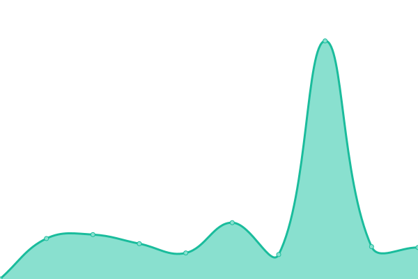

# [📈 Live Status](https://upptime.github.io/upptime): <!--live status--> **🟧 Partial outage**

This repository contains the open-source uptime monitor and status page for [Upptime](https://upptime.js.org), powered by [Upptime](https://github.com/upptime/upptime).

With [Upptime](https://upptime.js.org), you can get your own unlimited and free uptime monitor and status page, powered entirely by a GitHub repository. We use [Issues](https://github.com/upptime/upptime/issues) as incident reports, [Actions](https://github.com/nanbowaner/upptime/actions) as uptime monitors, and [Pages](https://upptime.github.io/upptime) for the status page.

<!--start: status pages-->
<!-- This summary is generated by Upptime (https://github.com/upptime/upptime) -->
<!-- Do not edit this manually, your changes will be overwritten -->
<!-- prettier-ignore -->
| URL | Status | History | Response Time | Uptime |
| --- | ------ | ------- | ------------- | ------ |
|  [Google](https://www.google.com) | 🟩 Up | [google.yml](https://github.com/nanbowaner/upptime/commits/HEAD/history/google.yml) | 

 74ms
     
 | 

<a href="https://nanbowaner.github.io/upptime/history/google">100.00%</a>
    

|  [Test Broken Site](https://thissitedoesnotexist.koj.co) | 🟥 Down | [test-broken-site.yml](https://github.com/nanbowaner/upptime/commits/HEAD/history/test-broken-site.yml) | 

 0ms
     
 | 

<a href="https://nanbowaner.github.io/upptime/history/test-broken-site">100.00%</a>
    

|  [cmx.im](https://m.cmx.im) | 🟩 Up | [cmx-im.yml](https://github.com/nanbowaner/upptime/commits/HEAD/history/cmx-im.yml) | 

 625ms
     
 | 

<a href="https://nanbowaner.github.io/upptime/history/cmx-im">100.00%</a>
    

|  [inoreader](https://www.inoreader.com) | 🟩 Up | [inoreader.yml](https://github.com/nanbowaner/upptime/commits/HEAD/history/inoreader.yml) | 

 673ms
     
 | 

<a href="https://nanbowaner.github.io/upptime/history/inoreader">100.00%</a>
    

|  [archive.ph](https://archive.ph) | 🟩 Up | [archive-ph.yml](https://github.com/nanbowaner/upptime/commits/HEAD/history/archive-ph.yml) | 

 1256ms
     
 | 

<a href="https://nanbowaner.github.io/upptime/history/archive-ph">99.67%</a>
    

|  [disroot](https://cloud.disroot.org) | 🟩 Up | [disroot.yml](https://github.com/nanbowaner/upptime/commits/HEAD/history/disroot.yml) | 

 1591ms
     
 | 

<a href="https://nanbowaner.github.io/upptime/history/disroot">99.64%</a>
    

|  [bgme.tv](https://bgm.tv) | 🟩 Up | [bgme-tv.yml](https://github.com/nanbowaner/upptime/commits/HEAD/history/bgme-tv.yml) | 

 241ms
     
 | 

<a href="https://nanbowaner.github.io/upptime/history/bgme-tv">100.00%</a>
    

|  [ddrk](https://ddrk.me) | 🟥 Down | [ddrk.yml](https://github.com/nanbowaner/upptime/commits/HEAD/history/ddrk.yml) | 

 56ms
     
 | 

<a href="https://nanbowaner.github.io/upptime/history/ddrk">0.00%</a>
    

|  [ddrk v2](https://ddrk.me) | 🟥 Down | [ddrk-v2.yml](https://github.com/nanbowaner/upptime/commits/HEAD/history/ddrk-v2.yml) | 

 13ms
     
 | 

<a href="https://nanbowaner.github.io/upptime/history/ddrk-v2">0.00%</a>
    

<!--end: status pages-->

[**Visit our status website →**](https://upptime.github.io/upptime)

## 📄 License

- Powered by: [Upptime](https://github.com/upptime/upptime)
- Code: [MIT](./LICENSE) © [Upptime](https://upptime.js.org)
- Data in the `./history` directory: [Open Database License](https://opendatacommons.org/licenses/odbl/1-0/)
